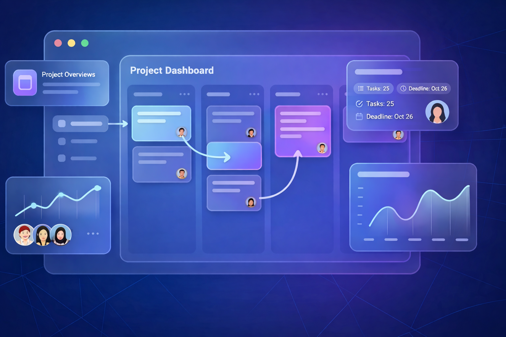

# TaskSphere Frontend

<div align="center">

### Modern Project & Task Management Frontend

**Live Demo:** [https://tasksphere.io.vn](https://tasksphere.io.vn)  
**Production API:** [https://api.tasksphere.io.vn/api](https://api.tasksphere.io.vn/api)  
**Swagger UI:** [https://api.tasksphere.io.vn/swagger-ui.html](https://api.tasksphere.io.vn/swagger-ui.html)


</div>

<p align="center">
  
</p>

---

## Overview

TaskSphere Frontend is a production-oriented task and project management client built with **Next.js 15**, **TypeScript**, and **Tailwind CSS**. It connects to a Spring Boot backend and delivers a complete Agile workflow experience, including project dashboards, Kanban boards, sprint planning, backlog grooming, task tracking, real-time notifications, and reporting.

This repository is a strong showcase of frontend engineering skills for recruiter review:

- Building with **Next.js App Router**
- Structuring a medium-sized **TypeScript React codebase**
- Managing API state with **TanStack Query**
- Handling global UI state with **Zustand**
- Integrating **real-time updates**, forms, charts, and role-based UX
- Shipping a deployable frontend with **Docker**

---

## Key Features

| Area | Highlights |
|---|---|
| Authentication | Sign in, sign up, forgot password, OTP flows, protected routes |
| Dashboard | Personal KPIs, upcoming deadlines, active projects, recent activity |
| Project Workspace | Overview, Kanban board, backlog, sprint view, calendar, timeline |
| Task Management | Task detail panel, comments, checklist, attachments, worklog, dependencies, recurring tasks |
| Reporting | Burndown, velocity, member performance, overview metrics and charts |
| Collaboration | Member management, invite acceptance flow, mentions, notification center |
| Customization | Custom fields, custom board columns, version management, webhook settings |
| UX | Responsive layout, theme toggle, English/Vietnamese i18n, reusable UI components |

---

## Tech Stack

| Layer | Technology |
|---|---|
| Framework | Next.js 15 (App Router) |
| Language | TypeScript |
| UI | Tailwind CSS, shadcn/ui, Radix UI |
| Data Fetching | TanStack Query |
| State Management | Zustand |
| Forms & Validation | React Hook Form, Zod |
| Charts | Recharts |
| Animation | Framer Motion |
| Rich Text | Tiptap |
| Realtime | STOMP / SockJS |
| Internationalization | i18next, react-i18next |
| Containerization | Docker, Docker Compose |

---

## Getting Started

### 1. Install dependencies

```bash
npm install
```

### 2. Create environment files

Use the provided examples:

```bash
cp .env.development.example .env.development
cp .env.production.example .env.production
```

If you are on PowerShell:

```powershell
Copy-Item .env.development.example .env.development
Copy-Item .env.production.example .env.production
```

### 3. Start the development server

```bash
npm run dev
```

Open [http://localhost:3000](http://localhost:3000).

---

## Environment Variables

| Variable | Purpose | Example |
|---|---|---|
| `NEXT_PUBLIC_API_URL` | Backend API base URL | `http://localhost:8080/api` |
| `NEXT_PUBLIC_APP_URL` | Frontend public URL | `http://localhost:3000` |
| `WEBAPP_HOST_PORT` | Docker host port mapping | `3001` |
| `APP_ENV_FILE` | Docker Compose env file selector | `.env.development` |

---

## Available Scripts

| Command | Description |
|---|---|
| `npm run dev` | Run the app locally in development mode |
| `npm run build` | Build the production bundle |
| `npm run start` | Start the production server |
| `npm run prettier` | Check formatting |
| `npm run prettier:fix` | Fix formatting |
| `npm run docker:dev` | Build and run with Docker using `.env.development` |
| `npm run docker:prod` | Build and run with Docker using `.env.production` |

---

## Docker

Run the app in Docker:

```bash
npm run docker:dev
```

For a production-like container run:

```bash
npm run docker:prod
```

---

## Project Structure

```text
app/          Next.js app routes, pages, API route handlers, services, types
components/   Reusable UI and feature modules
hooks/        Custom hooks for data fetching and business flows
lib/          Shared utilities, axios clients, realtime helpers
stores/       Zustand stores
public/       Static assets and screenshots
```

---

## Backend

This frontend is designed to work with the TaskSphere backend API exposed at:

- Production API: [https://api.tasksphere.io.vn/api](https://api.tasksphere.io.vn/api)
- Swagger UI: [https://api.tasksphere.io.vn/swagger-ui.html](https://api.tasksphere.io.vn/swagger-ui.html)

---

## License

[MIT](LICENSE)
